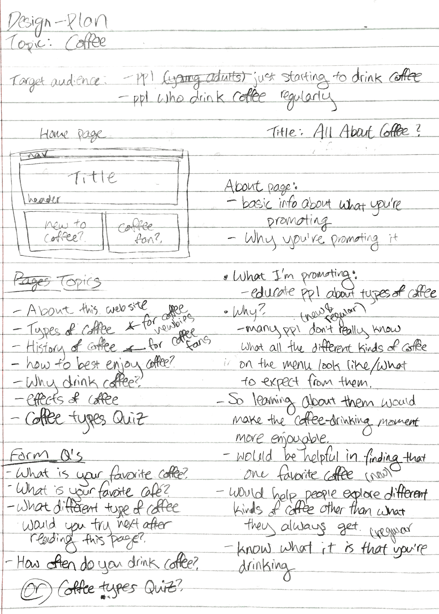
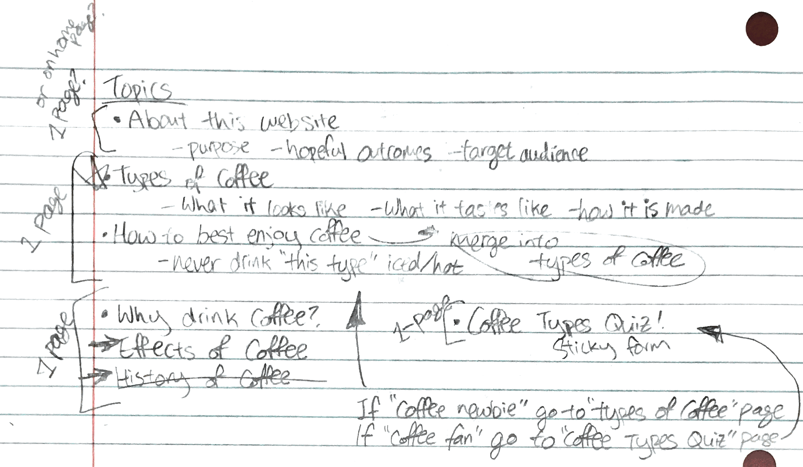
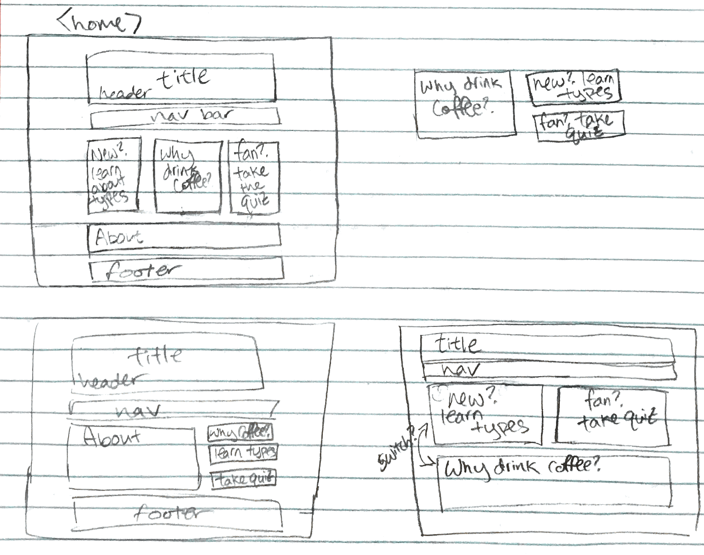
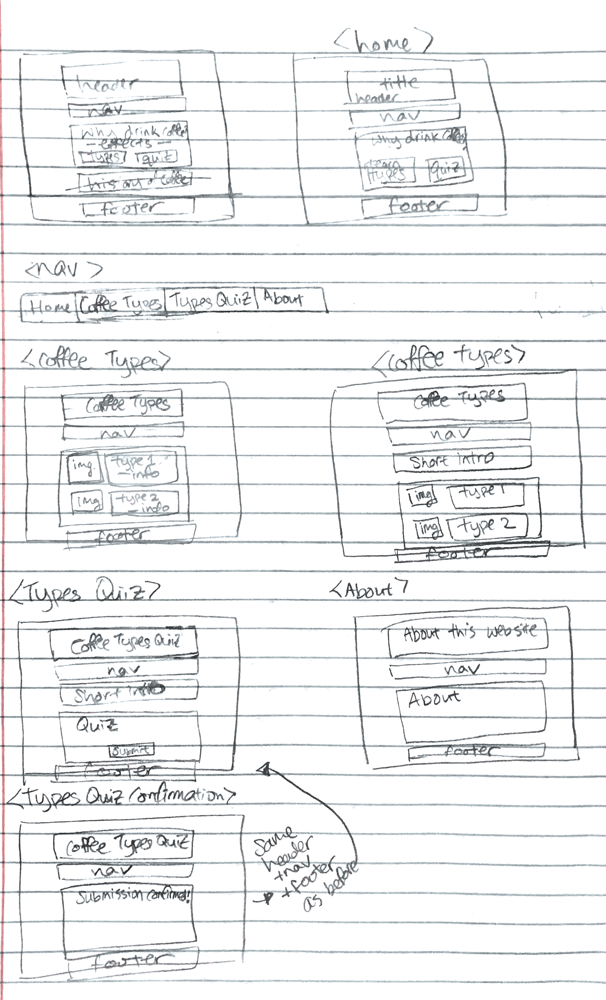
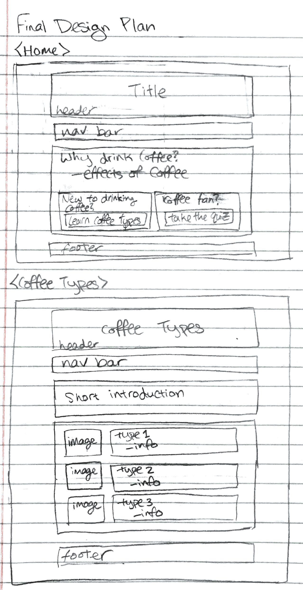
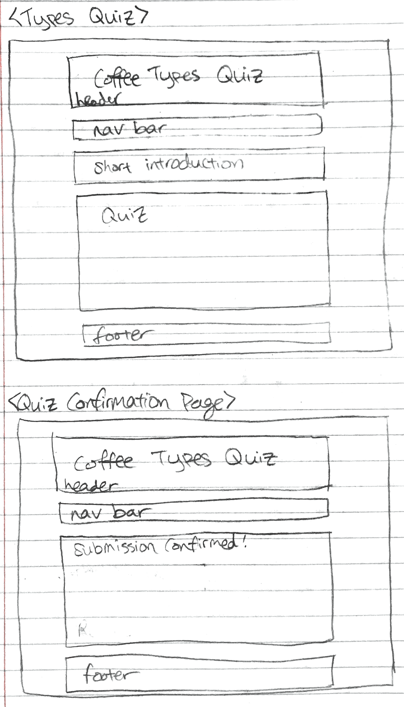
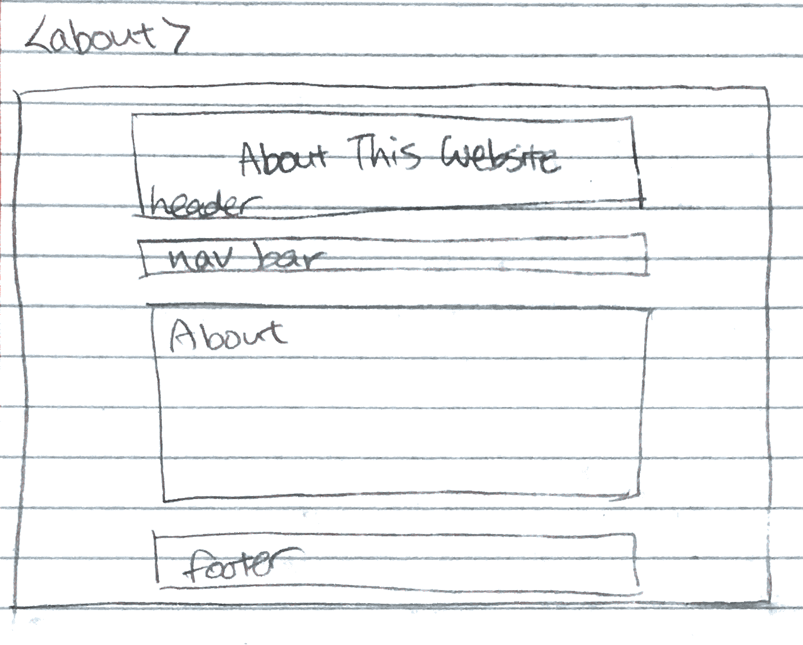
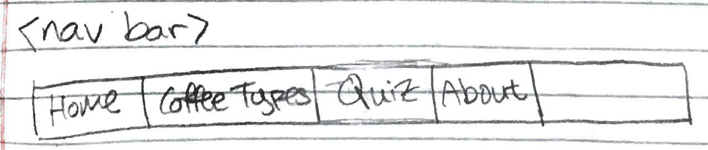

# All About Coffee

Author: Sungmin Kim

Website Development Period: 2/5/19 ~ 2/19/19

This website was created as a project for a course at Cornell University named Intermediate Web Development (INFO 2300). Languages used are: PHP, HTML, CSS.

# 1. Design & Plan

## Website Topic

I want to promote the various basic types of coffee that many people may not exactly know what they consist of. The various types of coffee introduced in this website would help people get a better sense of what it is that they are drinking and thus make the coffee-drinking moment more enjoyable.

## Target Audiences

My target audiences are people who just started to drink coffee ("coffee newbies") and regular coffee drinkers ("coffee fans").

## Design Process

I first started out by figuring out what content I wanted in the website and how they would divide up into different topics. I also tried to think of what the sticky form would be about.

Then I listed out all the topics that I wanted and tried to figure out how to group them. In the process, I was able to identify the different pages I wanted. At this point, I was still unsure as to what information to put on the home page. Should I have the "About this website" info on the home page? Should I have the "Why drink coffee?" topic on the home page? Should I just have buttons leading to each of the pages with short descriptions of each on the home page?
This is also the point at which the idea of creating a coffee types quiz came up. I realized that this quiz would help better serve the needs of the "coffee fan" audience who may not necessarily want to start off reading about coffee types that they already know. This could also fulfill the sticky form requirement. Initially I thought about attaching this quiz to the end of the "coffee types" page, but later changed my mind to make it its own page.

Then I set off to design the home page. It took me the longest to design the home page. I wasn't quite sure what kind of layout would be best. At first I thought of the three column short intro with buttons to each page layout (top left on below image). The concern I had here was whether it was a good idea to split off the "coffee newbie" section and the "coffee fan" section with the "why drink coffee?" section in the middle. I also wasn't sure if I wanted the "About" information on the home page. So I sketched out various different layouts.

After creating the second layout (bottom left on above image) with the big "About" section, I decided that it may be better to not have "About" on the home page. So then I switched over toward displaying the "Why drink coffee?" information on the home page. In the process, I figured the "history of coffee" topic does not really fit well with all the other topics so decided to get rid of it.

The other pages didn't take as long to create the layout of. I kept the header, nav bar, and the footer the same for all pages for consistency. Only the header text would be changing to each page title. For the "Coffee Types" page, I added a short introduction section before actually introducing the coffee types because I wanted to ease the reader into the information better. For the same reason, the "Coffee Types Quiz" page also starts with an intro before the actual quiz. In general, I think I tried to go more towards simplicity for better readability.

## Final Design Plan

Navigation Bar
<ul>
  <li> Home: Directs visitors to the appropriate page link. </li>
  <li> About: Contains information about this website, such as the purpose and target audience, as well as hopeful outcomes from reading this website. Most of this is described in the "Website Topic" section above and the "Target Audiences' Needs" section below. </li>
  <li> Coffee Types: Introduces the various basic types of coffee with pictures. Descriptions include: what it is, how it is made, how it's different from other similar types of coffee, etc. If there are any specific ways that could possibly better your enjoyment of that coffee (such as never drink this type of coffee iced), that would also be included here. </li>
  <li> Coffee Types Quiz: Displays a short quiz about the types of coffees covered in the "Coffee Types" page. </li>
</ul>

## Target Audiences' Needs

This website would help the "coffee newbies" have a better understanding of the coffee shop menu as well as help their journey towards their favorite coffee. For "coffee fans", it would be a fun experience of quizzing themselves on what they already know about the various coffee types and filling in the parts that they didn't know. This website would help "coffee fans" possibly try out for a different type of coffee than what they always get.

## Templates

<ul>
  <li> init.php </li>
  <li> header.php with the navigation bar</li>
  <li> footer.php </li>
</ul>

# 2. Draft Website

## Sticky Form

[What fields are required for your form?]

All fields are required for the form since it is a quiz.

[Plan out your error messages for your target audiences.]

I will initially hide the error messages and show them when no input is detected. The error messages would ask the quiz taker to make sure to fill out all questions of the quiz, as well as to fill out the name. The error message would be placed before the form starts.

The confirmation page would show all the answers to the questions that the quiz taker inputted.

## Validation Code Plan

[Pseudocode plan for handling the validation of the form.]

if submitted:  
  first assume all the inputs are valid  
  read in all input values and set variables for each  
  for each input values, check to make sure everything is valid (i.e. no empty string for name, at least one button is pressed for question, etc)  
  if not valid, show error message  
  else show confirmation page  

# Complete & Polished Website

## Target Audiences

[Tell us how your final site meets the needs of the target audiences. Be specific here. Tell us how you tailored your design, content, etc. to make your website usable by both target audiences.]

My final site meets the needs of the target audiences in that it has a "Coffee Types" page with information about various common coffee types for the "coffee newbies" and the "Coffee Types Quiz" page with a short quiz about coffee types for the "coffee fans".

## Reflection

[Take this time to reflect on what you learned during this assignment. What things did you have trouble with?]

I learned a lot on how to make my forms sticky and indicate the current page on the navigation bar. I definitely improved in my html and css skills in general since it has been a while since I had coded in html/css.